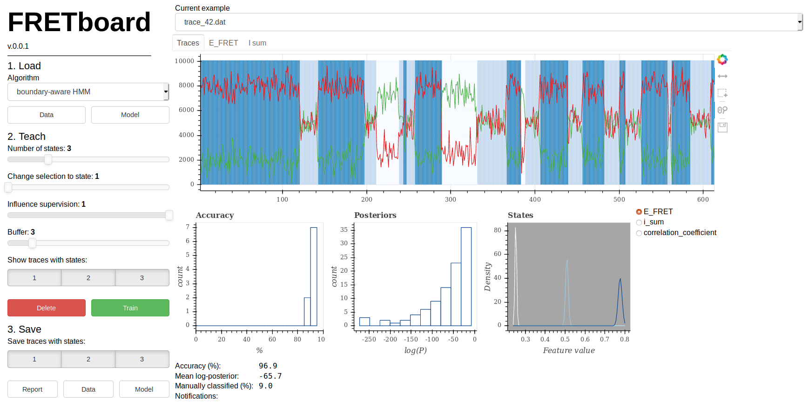

# FRETboard: supervise your FRET detection algorithm

[](https://zenodo.org/badge/latestdoi/213605221)

FRETboard helps you train algorithms for the detection of Förster resonance energy transfer events in a 
(semi-)supervised manner.

## Running
FRETboard is available as web application on [our server at Wageningen University](https://www.bioinformatics.nl/FRETboard/), or can be installed on your own 
Linux or MacOS system using pip:

```
pip install git+https://github.com/cvdelannoy/FRETboard.git
```
FRETboard is then started from the command line as:

```
FRETboard 
```
A session on a random free port will start automatically.

## Usage
Training an algorithm using FRETboard is easy; just follow the steps in the left column of your screen:


#### 1. Load
Pick an algorithm from the drop-down menu. For now three types are available:
- The vanilla hidden Markov model (HMM) - a simple fully connected HMM - should do for low noise data.
- The boundary-aware HMM tries to improve state detection by adding extra states.
- The GMM-HMM implements the boudary-aware HMM but models state emissions using Gaussian mixture models. This
works best for typical noisy FRET traces.

Instead, you may load a model of a previous time you used FRETboard if you have it. Now load your data with the Data button.
Tick the `DBSCAN background subtraction` box if your traces suffer from high background intensity. The lowest level in each
trace will be detected using the DBSCAN algorithm and set to zero.

#### 2. Teach
After loading your data you are presented with an example trace that the model found hard to classify. 
Clicking the symbols to the right of the trace lets you switch between panning and zooming with your scroll wheel.
Caught an error? Slide the 'Change selection' 
slider or press a number key on your keyboard to set the state to which you would like to change classifications and click-drag over the trace in your screen. You have now 
adapted the labeling of that trace. Once you are satisfied with the current trace, click `Train` to retrain 
the algorithm using the modifications you just made as a guideline. Once done, click `New` to go to the next trace 
and repeat the process, until you're satisfied with the classification result. 

While training, the training accuracy and posterior probability histograms can be used as indication of your model quality.

A few more options are available to you in this stage:
- You can `Delete` the current trace, omitting it from further supervision and analysis.
- Number of states: changes how many states the HMM will try to fit. Note that changing this value will reset your model!
- Active features: depending on your data and goals, features may contribute valuable information or just noise. You can change
- Guess trace: if your current trace is very long, correct classification in a short stretch and click this button.
Then select your correctly classified stretch and a tiny HMM will be trained to guess the correct classification for the 
rest of this particular trace to save you a bit of time.
which features you want to use in the bottom right of your screen, and then click `Train` to see the effect on accuracy. Current models train
generally quickly, so you can play around to see what works for you. The feature distrubtions per state displayed in the screen can give
an indication of whether a feature is helpful (i.e. some separation in displayed curves) or not.
 
#### 3. Save
You may now download the classified traces on your machine using the 'Data' button. Produce a 
[Report](FRETboard_example_report.html) (download and view in browser) to see the
model parameters generated, along with some summary statistics and graphs or download the model to 
quickly classify your data next time using the same parameters. Deselecting certain states here omits traces containing
that state from your save file and the analysis report, which is handy if you captured all bleaching events in a given state.

#### Advanced options
The `Settings` tab contains some options for specific or more advanced use cases.

##### ALEX
To load ALEX data, tick the box in this section.

If provided ALEX data FRETboard can perform corrections for direct acceptor excitation, crosstalk and detector efficiency. It can
even esimate the rquired parameters if you do not have these (l, d and gamma), but for this a donor-only, acceptor-only and at least
two other FRET states must be present in your data. 

##### Filtering options
Stringency of the DBSCAN background intensity filter is controlled by the tunable parameter `epsilon`, 
which is defined as the maximum distance between a cluster’s core point and distant points of 
the same cluster. The preset value of 15 typically works well, but if too much is subtracted
this can be set to a lower value. 

##### Training options 
The `supervision influence level` is the weight that is assigned to supervised examples
when training (and 1 - the weight assigned to unsupervised examples). 1 denotes fully supervised training, 
0 means that  supervised examples play no role at all during training.

If you're training a boundary-aware or GMM-HMM (and possibly other algorithms in the future), 
the `buffer` value defines the number of boundary states that are defined between
states. One typically works well, however for slow transitions this can be increased
for better results.

Lastly you can set the number of times that the data is bootstrapped to find confidence 
intervals (CIs) on the transition rates when generating a report.

## Accepted data format
The following data formats are accepted:

| Format      | Description                                                                                                                                                                                   | Extension |
|-------------|-----------------------------------------------------------------------------------------------------------------------------------------------------------------------------------------------|-----------|
| plain text  | Three tab-separated columns: time (s), donor intensity, acceptor intensity.  No header.                                                                                                       | .dat      |
| binary      | 16-bits, only equal-duration traces. First three numbers are trace duration,  any (unused placeholder), number of traces. Time step size and ALEX/non-ALEX must be set in the `settings` tab. | .traces   |
| photon-HDF5 | As defined [here](https://photon-hdf5.readthedocs.io/). Donor and acceptor pixel ID should be stored as `spectral_ch1` and `spectral_ch2`. Each `photon_data` group is treated as a separate trace. | .hdf5     |

Examples are stored in the data_format_examples directory. 

## Known issues
- Please note that FRETboard cannot (yet) handle traces longer than 100k data points. This is mainly a 
grahical issue, so we expect to be able to fix this rather soon.
- Currently keystrokes to change the state slider and perform the next/train/delete actions only work in 
server mode. 

## Setting up your own server
The easiest way to set up your own FRETboard server would be to make use of the docker image. First start up the container in interactive mode:
```
docker run -p 0.0.0.0:5102:5102/tcp -it cvdelannoy/fretboard /bin/bash
```
FRETboard is best served using the bokeh package on which the user interface is built. In the container run:
```
bokeh serve --num-procs 1 --check-unused-sessions 1000 --port=5102 --address=0.0.0.0 FRETboard/FRETboard
```
If you expose the GUI through a certain website, you may need to add `--allow-websocket-origin=www.mywebsite.com` .
For more options, see the bokeh documentation on running a server [here](https://docs.bokeh.org/en/latest/docs/user_guide/server.html#deployment-scenarios). 

## Writing new algorithms
If you would like to introduce a new (semi-)supervised algorithm to FRETboard, you can do so easily; follow the 
instructions [template](model_template.py) and everything should work accordingly. Do consider making a pull request 
if you think your implementation may be useful to others! Of course, contributors will be fairly referred to. 

---
with &hearts; from Wageningen University